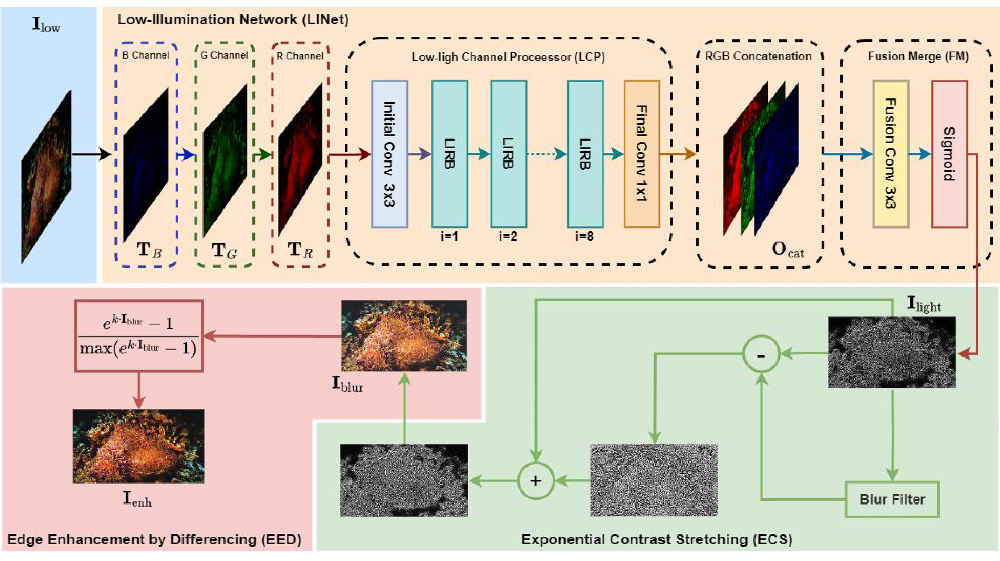

# [IEEE Access'25] CLEAR: An Efficient Low-Illumination Enhancement Method for Improved Visibility in Underwater Images

## 🎯 1. Overview

This repository contains the source code and supplementary materials for the paper titled CLEAR: An Efficient Low-Illumination Enhancement Method for Improved Visibility in Underwater Images. This research focuses on the visual enhancement of underwater images with low-illumination. The paper has been accepted for publication in IEEE Access.



## 🛠️ 2. Requirements

1. opencv-python == 4.9.0.80
2. scikit-image == 0.22.0
3. numpy == 1.24.3
4. torch == 2.3.0+cu118
5. Pillow == 10.2.0
6. tqdm ==  4.65.0
7. natsort == 8.4.0
8. torchvision == 0.18.0+cu118

## 🧪 3. Inference
To test the model, follow these steps:

1. Place your images to be enhanced in the ./1_Input directory.

2. Run the code with the following command:

   ```bash
   python inference.py

3. The enhanced images will be saved in the ./2_Output directory.
